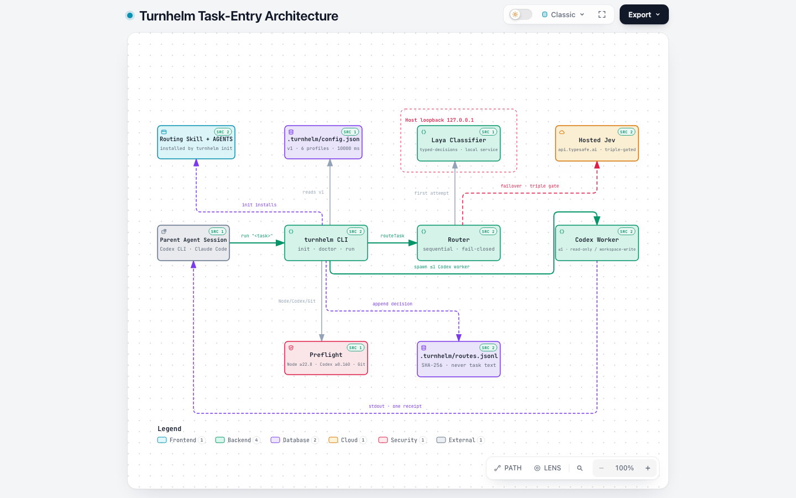
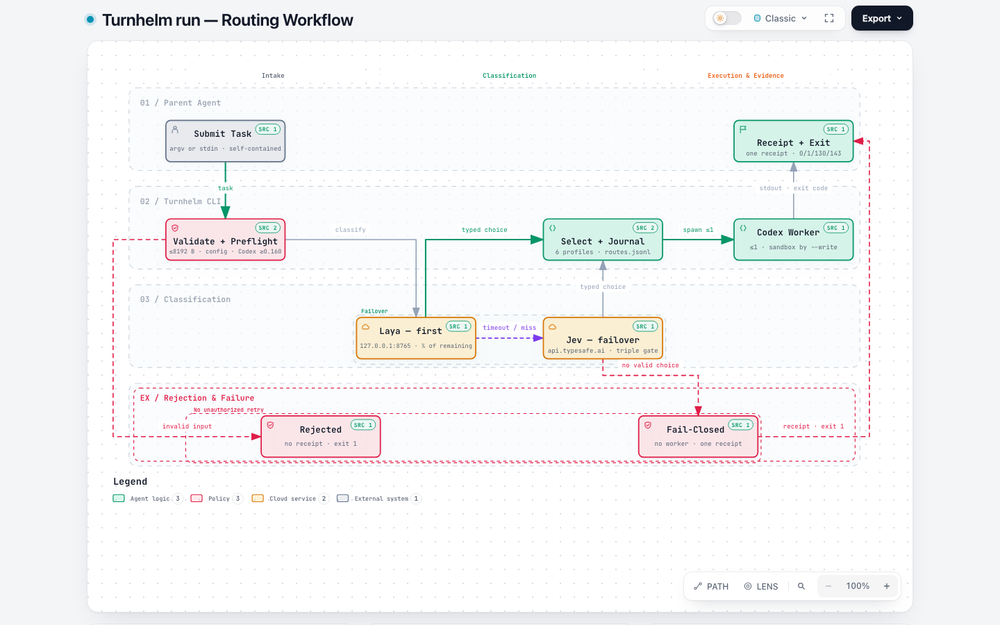

# turnhelm

Local-first task entry for Codex. Turnhelm classifies a coding task against
six fixed model/reasoning-effort profiles, then starts a separate Codex
process with an explicit sandbox boundary.

Turnhelm does **not** switch the model or permissions of the current Codex or
Claude Code session. It is a parent-agent launcher: read-only by default,
workspace writes only with an explicit `--write` command. Codex remains
responsible for its own authentication and provider access.

## Commands

| Command | Behavior | Child sandbox |
| --- | --- | --- |
| `turnhelm init [--dry-run]` | Install the managed skill, project config, and AGENTS block | No Codex child |
| `turnhelm doctor [--json] [--probe]` | Report project, toolchain, config, and skill readiness | No Codex child |
| `turnhelm run [--write] [--] ["<task>"]` | Route the complete task, then start at most one Codex child | `read-only`; `workspace-write` only with `--write` |

All three commands accept `--project <dir>` (relative to the current directory
or absolute). Without it, the current directory is the project root; Turnhelm
does not search parent directories for config or instructions.

The task comes from one self-contained positional argument **or** stdin, not
both (valid UTF-8, at most 8192 bytes; never truncated). Blank, NUL-containing,
continuation-only and invalid/oversized input is rejected. Use `--` before a
task starting with `--`; put all command options before the delimiter. The
router and child do not inherit your current session's conversation.

## Quick start

Requirements: Node.js `>=24.0.0` (Node 22.8 support has been dropped;
validation runs on an actual `24.x >=24.5.0`), pnpm `10.12.1` (pinned in
`package.json`), a local Git work tree, and a Codex CLI 0.160.0 or newer.

```bash
# From the Turnhelm source checkout:
pnpm install --frozen-lockfile --ignore-scripts
pnpm run build
TURNHELM_CLI="$PWD/dist/src/cli.js"
turnhelm() { node "$TURNHELM_CLI" "$@"; }

# Replace this with your target Git work tree (not the Turnhelm checkout).
PROJECT=/absolute/path/to/your/project
turnhelm init --project "$PROJECT" --dry-run
# Obtain approval for the reported installation writes before applying them.
turnhelm init --project "$PROJECT"

# Offline readiness: may run local version/help checks, never inference.
turnhelm doctor --project "$PROJECT"
```

The shell function is local to this shell: building does not install a global
`turnhelm` command. You can also call `node "$TURNHELM_CLI" <command>` directly.
Restart existing Codex sessions after initialization to load the instructions.

`init --dry-run` reports planned paths without writing. Repeating `init` is a
no-op when already installed; valid existing project config and unrelated
AGENTS content are preserved. Invalid config, changed owned skill files, or
conflicting managed markers are refused, not overwritten. Inspect and resolve
conflicts yourself; if installation stops early, review its retained files.

The canonical project config template is
[assets/config.json](assets/config.json); `turnhelm init` installs it as
`.turnhelm/config.json`.

Before running a task, configure an eligible classifier and ensure it is
available. The default uses local Laya at `http://127.0.0.1:8765`; Turnhelm does
not install or start it. After approval to send the task to that backend:

```bash
turnhelm run --project "$PROJECT" "Explain this project's entry points without editing files."
# Alternative input (one complete task, not session shorthand):
printf '%s' "Explain this project's entry points without editing files." | turnhelm run --project "$PROJECT"
```

Use `turnhelm run --project "$PROJECT" --write "<complete task>"` only for an
explicitly approved edit. Requesting Turnhelm does not itself authorize writes
or hosted inference. `doctor --probe` is a separate explicit inference opt-in:
it sends one synthetic classification request per eligible backend, up to two;
plain `doctor` never contacts either classifier. Backend eligibility is not
evidence of successful routing or access to the selected Codex model.

## Start an existing local Laya

Reuse an already healthy service; do not start a duplicate. If none is running
and startup is authorized, this foreground reference is for an **already
installed** Laya 0.3.22 serve-capable virtual environment with cached
`typed-decisions` weights:

```bash
LAYA_PYTHON=/absolute/path/to/laya-venv/bin/python
HF_HUB_OFFLINE=1 TRANSFORMERS_OFFLINE=1 \
LAYA_HOST=127.0.0.1 LAYA_PORT=8765 \
LAYA_MODELS=typed-decisions LAYA_PRELOAD=1 \
LAYA_DEVICE=cpu LAYA_THREADS=4 \
"$LAYA_PYTHON" -I -B -u -m laya.serve
```

`4` is an example thread cap; keep it within the machine's physical cores.
The module entry avoids stale console-script shebangs after venv relocation.
Missing serve dependencies or cached weights mean stop and obtain approval
before installation/download. The offline flags constrain Hugging Face model
loading, not every possible network action.

Check from another terminal (no classification or Codex worker):

```bash
curl --fail --silent --show-error --max-time 5 http://127.0.0.1:8765/health
```

Expect `status: "ok"` and `typed-decisions` in `loaded`; inspect the reported
checkpoint device. This foreground example does not install a supervisor or enable
login/reboot autostart. Health alone does not prove a real task can be
classified within the routing deadline.

## Project configuration

`.turnhelm/config.json` (version 1) is Turnhelm's only configuration file. There
is no global or home-directory Turnhelm config; Codex manages its own settings
and authentication separately. Unknown project config keys are rejected.

```json
{
  "version": 1,
  "routingTimeoutMs": 10000,
  "backends": {
    "laya": { "enabled": true, "url": "http://127.0.0.1:8765" },
    "jev": { "enabled": false }
  },
  "profiles": {
    "fast": { "model": "gpt-6-luna", "effort": "low" },
    "balanced": { "model": "gpt-6.1-sol", "effort": "medium" },
    "deep": { "model": "gpt-6.1-sol", "effort": "high" },
    "frontier": { "model": "gpt-6-astra", "effort": "high" },
    "frontier_xhigh": { "model": "gpt-6-astra", "effort": "xhigh" },
    "frontier_max": { "model": "gpt-6-astra", "effort": "max" }
  }
}
```

- `routingTimeoutMs` is the total classification budget, an integer from 100
  to 30000; the current template uses 10000ms, not a latency guarantee.
  Existing project configs are not automatically updated.
- `backends.laya.url` must be an HTTP loopback origin without credentials,
  path, query, or fragment.
- All six profiles are required; each names a model and reasoning effort.

## Six profiles and automatic selection

Successful classification selects one of the six profiles; there is no bypass,
no max-effort flag, and no extra classification stage. `frontier_max` is an
ordinary selection outcome reached when the task genuinely needs maximum
effort.

Selection is judged by uncertainty, coupled constraints, required
verification, and the consequences of an incorrect result — never by prompt
length or keywords. The config above gives the template defaults, not a model-access
guarantee; project config supplies the actual model/effort pairs.

## Classification request and response

The task text is sent to the configured backend at `POST /v1/systemone`:

```json
{
  "state": "<task>",
  "model": "typed-decisions",
  "max_len": 8192,
  "questions": {
    "route": {
      "type": "choice",
      "instructions": "Choose the lightest profile that meets the task's requirements, judged by uncertainty, coupled constraints, required verification, and the consequences of an incorrect result; never by prompt length, file count, or keywords such as security, architecture, or deep analysis.",
      "criteria": { "fast": "...", "balanced": "...", "deep": "...", "frontier": "...", "frontier_xhigh": "...", "frontier_max": "..." }
    }
  }
}
```

Laya's `max_len` is a token window, distinct from the 8192-byte task limit.
Hosted Jev uses the same envelope with `model: "jev-latest"` and no `max_len`.
The required response shape is the nested choice answer:

```json
{ "answers": { "route": { "type": "choice", "choice": "<profileId>" } } }
```

`choice` must be one of the six own profile IDs; anything else fails that
backend attempt, with only the budgeted, authorized failover below available.
The reply may also carry `confidence`, a number in `[0, 1]`; Turnhelm validates
that range, records the value in the route journal, and never uses it to gate
selection.
When Laya returns `usage`, it must report `truncated: false` and
`state_tokens_dropped: 0`; otherwise that attempt fails. Absent usage does not
prove the classifier consumed the full task.

## Backend failover

Routing is sequential, not parallel. Local Laya is tried first when
`backends.laya.enabled` is true; a successful Laya choice means no Jev request.
When **both** backends are eligible, Laya receives `floor(remainingBudgetMs * 3 / 4)`:
approximately 7500ms of the default 10000ms total budget, reserving the other
quarter for authorized Jev failover. This avoids a fixed one-second cutoff for
CPU inference. Jev receives only the time left on the shared deadline; an early
Laya failure leaves it more time, while scheduling delays can leave it less.
A sole eligible backend receives the total remaining budget. These allocations
are engineering limits, not latency guarantees. Hosted Jev is attempted only
when **all** of the following hold: `backends.jev.enabled` is true in the
project config, `TURNHELM_ALLOW_HOSTED_JEV=1` is present in the environment,
and `TYPESAFE_API_KEY` is nonblank. The config and environment gates require
deliberate authorization for hosted inference; Turnhelm never enables them
automatically. Supplying a key alone does not opt in.

If no eligible backend returns a valid choice within the budget, routing fails
closed: no Codex child, heuristic fallback, or bypass. Backend failover stays
within the configured gates; classifier or model-access failure never triggers
an unapproved model retry. Local Laya may require `LAYA_API_KEY`.

## Route decision journal

Every `run` that reaches classification appends one JSON line to
`.turnhelm/routes.jsonl` in the project root before the worker starts,
regardless of whether routing selected, failed, or was cancelled. Each line
records the timestamp, the task's SHA-256 hash and byte length (never the task
text), the routing status, attempts with per-backend outcomes and durations,
and, for a selection, the backend, profile, model, effort, and the classifier's
`confidence` when the backend reports one. The journal is evidence for
reviewing routing decisions; it is written best-effort — an append failure is
reported on stderr and never fails the run. A journal path that is not a
regular file (for example a symlink or a FIFO) is refused and skipped rather
than opened.

## Safety boundaries

- **Read-only by default.** The Codex child receives `--sandbox read-only`
  unless `--write` was given explicitly on the same `run` invocation.
  `--write` does not override host sandbox restrictions on protected paths.
- **No recursion.** Turnhelm marks its Codex children with
  `TURNHELM_MANAGED_CHILD=1`; `run` inside such a session is refused.
- **Initial process environment only.** `LAYA_API_KEY`,
  `TYPESAFE_API_KEY`, `TURNHELM_ALLOW_HOSTED_JEV`, and `TURNHELM_CONFIG`
  are removed from the environment passed when spawning the Codex worker.
  This is not host filesystem secret isolation: a worker's later shell can
  reload keys from startup files. Existing validation observed `.zshenv`
  reintroducing the Jev key. Keep secrets out of tasks, logs, diffs and config;
  do not read key values or change host authentication/startup files to make
  a check pass.
- **Bounded child output.** Raw worker stderr and arbitrary error text never
  cross the diagnostic boundary; the parent prints fixed-category lines and
  the structured receipt on stderr. Worker messages go to stdout; this is
  not a general-purpose redactor for secrets in those messages.
- Remove secrets and sensitive data from a task before routing; the full
  task text is sent to the configured classifier.
- **Cancellation.** `run` and `doctor` handle SIGINT/SIGTERM, abort owned work,
  and stop their owned subprocess groups (exit 130/143). Before classification,
  cancellation or task/config/preflight rejection emits no run receipt. Once
  classification starts, `run` emits exactly one JSON receipt on stderr at the
  end, including routing failure/cancellation and the worker outcome.
  Client cancellation does not prove backend inference has stopped.

## Usage evidence is honest, not authoritative

- When the Codex child reports no usage snapshot, the receipt says
  `usage: "unreported"` — never zero and never omitted.
- `classifierUsage` is `"unreported"` and `wholeRunUsageScope` is
  `"unverified"`: receipts report worker snapshots, not a whole-run token
  total, bill or saving percentage. The recorded real runs used ChatGPT
  login; that is not evidence of API-key metered charges.
- Codex client config-key semantics (for example `agents.enabled`) are
  **unverified** from `--help` evidence alone; doctor reports this
  explicitly instead of claiming a pass.

## Validate routing with the actual requirement

On the intended branch, submit the complete real task once; do not force a
profile or add a preliminary worker merely to test routing. Put the complete
requirement and execution boundaries in a UTF-8 file, not an abbreviated smoke
prompt (the same 8192-byte limit applies):

```bash
TASK_FILE=/absolute/path/to/complete-task.txt
# Obtain explicit write authorization immediately before this invocation.
turnhelm run --project "$PROJECT" --write < "$TASK_FILE"
```

Read the exit code and the receipt's `routing`, `selection`, and `worker`
statuses, then review the scoped diff and tests. A selected model is not
acceptance of its output. If no valid choice is obtained within the total
routing budget, no worker starts; a single Laya timeout can still be followed
by an authorized Jev success. Report routing/worker failure instead of silently
increasing the budget or retrying a different model/backend.

To exercise both eligible classifiers, obtain separate request/hosted consent
before `turnhelm doctor --probe --json --project "$PROJECT"`. It sends one
synthetic request per eligible backend but no worker. Both probe results plus
one successful real task prove only those observed paths, not general quality,
all six model/effort combinations, whole-task cost, or savings.

These checks have different execution and authorization scopes:

| Check | Classifier requests | Actual Turnhelm worker |
| --- | --- | --- |
| Plain `doctor` | None; offline version/help/config checks | None |
| `doctor --probe` | One synthetic request per eligible backend, at most two | None |
| Normal `run` | Full real task; at most one attempt per eligible backend, sequentially | At most one, after selection |
| `pnpm run test:live` | Up to 48 (six labelled prompts × four repeats × two isolated backends) | None |

`test:live` is a separately authorized real-classifier test, not part of the
offline suite and not a worker/model-access test. Do not use it, help/health,
or a short `1+1` smoke prompt as acceptance of the actual documentation or
implementation task. Receipt request counts are client attempts, not proof
of server receipt or billed requests; generic tool-progress lines are not a
count of the worker's internal calls.

## Agent skills (Codex CLI + Claude Code)

The canonical shared skill is
`.agents/skills/turnhelm-routing/SKILL.md`; `turnhelm init` installs it into
the project and the package includes that same file. In this source checkout,
`.claude/skills/turnhelm-routing` is a symlink to the shared directory; preserve
it, not a separate Claude copy. `init` refuses differing installed skill bytes,
so updating the source template does not silently migrate existing consumers.
Codex CLI and Claude Code use the same instructions:
one self-contained prompt, read-only default, explicit `--write`, automatic
`frontier_max` selection, and no unapproved model retry after failure.

## Development and verification

```bash
pnpm install --frozen-lockfile --ignore-scripts
pnpm run build

# Hermetic tests: do not use classifier credentials or hosted Jev.
env -u TYPESAFE_API_KEY -u LAYA_API_KEY -u TURNHELM_ALLOW_HOSTED_JEV pnpm test
env -u TYPESAFE_API_KEY -u LAYA_API_KEY -u TURNHELM_ALLOW_HOSTED_JEV pnpm run test:coverage

# Dependency audit.
pnpm audit --audit-level high
```

The minimum Codex contract remains **0.160.0**. Compatibility evidence includes
0.160.0 (official native binary:
`--version` exit 0, `exec --help` advertising `--json`, `--ephemeral`,
`--sandbox`, and stdin), local 0.160.1, and actual **0.161.0** use in the
post-merge Laya → Codex and hosted Jev → Codex runs. Both returned the same
eight-case coupon oracle correctly with CLI/worker exit 0, naturally selecting
different profiles. These are observed paths, not six-profile access,
classification-quality or billing guarantees. Functional delivery does not
authorize a benefit trial; a fixed-baseline comparison needs separate owner
approval. Detailed, dated evidence and remaining limits are recorded in
[`docs/validation/2026-10-08-turnhelm-task-entry.md`](docs/validation/2026-10-08-turnhelm-task-entry.md).
The [2026-10-05 design](docs/superpowers/specs/2026-10-05-turnhelm-task-entry-design.md)
and [implementation plan](docs/superpowers/plans/2026-10-05-turnhelm-task-entry.md)
are historical design records, not current invocation instructions.

## Diagrams

Interactive, evidence-pinned diagrams live under [`.archify/`](.archify/).
GitHub Markdown cannot embed interactive HTML, so the static captures below
link to the artifacts; open the HTML files locally (for example
`open .archify/architecture-turnhelm-20261009-130339/turnhelm-architecture.html`)
for the interactive versions with zoom, guided views, and source links.

[](.archify/architecture-turnhelm-20261009-130339/turnhelm-architecture.html)

[Architecture](.archify/architecture-turnhelm-20261009-130339/turnhelm-architecture.html)
— components, the host-loopback boundary, and trust gates.

[](.archify/workflow-turnhelm-run-20261009-130339/turnhelm-run-workflow.html)

[Routing workflow](.archify/workflow-turnhelm-run-20261009-130339/turnhelm-run-workflow.html)
— one `turnhelm run` from task submission to receipt, including rejection
and fail-closed paths.
