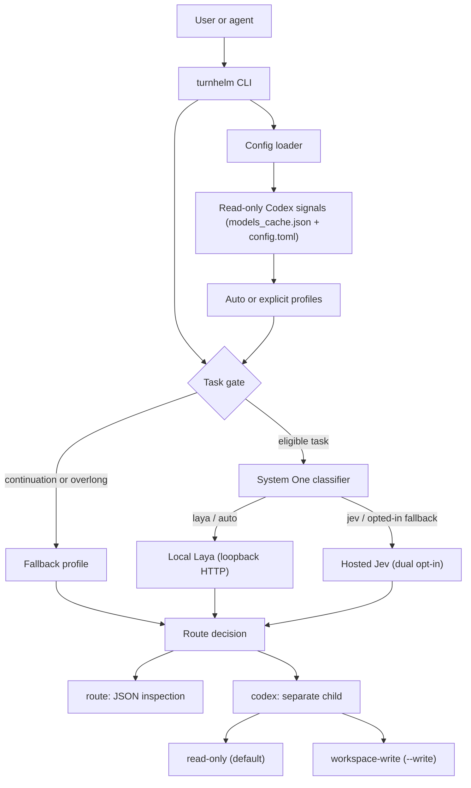
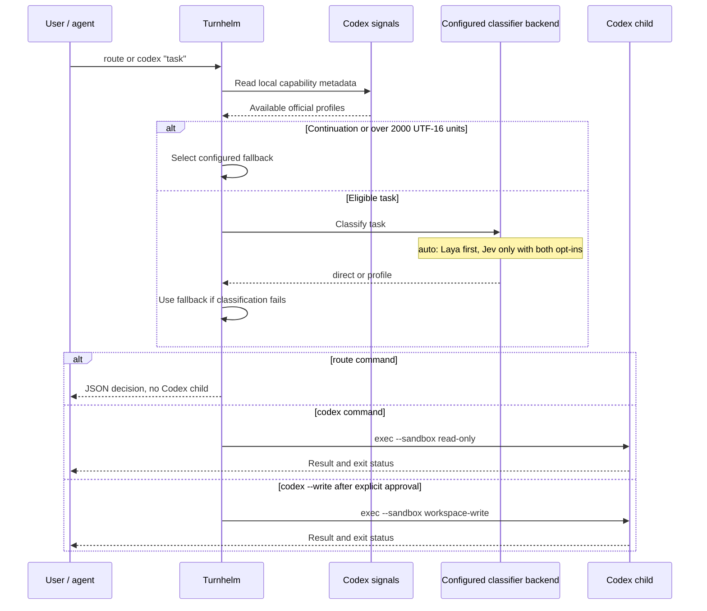

# turnhelm

Local-first task routing for Codex. Turnhelm classifies a task, selects one
validated model/reasoning-effort profile, and starts a separate Codex process
with an explicit sandbox boundary.

Turnhelm does **not** switch the model or permissions of the current Codex or
Claude Code session. It is a parent-agent launcher: read-only by default,
workspace writes only with an explicit `--write` command. Codex remains
responsible for its own authentication and provider access.

## What it provides

- **Capability-aware profiles** — auto mode materializes only official
  model/effort pairs available to the local Codex installation.
- **Local-first classification** — with `backend: auto`, Laya runs on loopback
  first; hosted Jev is available only through a deliberate dual opt-in.
- **Fail-closed routing** — invalid input, unavailable capabilities, classifier
  failures, and missing fallbacks never trigger an unapproved model retry.
- **Bounded child execution** — Codex receives either `read-only` (default) or
  `workspace-write` (explicit) sandbox permissions.
- **Shared agent skill** — Codex CLI and Claude Code use the same
  `turnhelm-routing` instructions.

## Architecture



The capability resolver reads bounded local metadata only. It does not make a
runtime network request, start a Codex subprocess, run a paid probe, persist a
snapshot, or mutate user configuration.

## Routing flow



## Quick start

Requirements: Node.js `>=22.8.0` and a local Codex CLI installation.

```bash
npm ci --ignore-scripts
npm run build

mkdir -p "$HOME/.config/turnhelm"
cp examples/config.json "$HOME/.config/turnhelm/config.json"

# Inspect the route without starting a Codex child.
node dist/src/cli.js route "Review the authentication boundary"

# Run a separate Codex child in read-only mode.
node dist/src/cli.js codex "Review the authentication boundary"
```

If the package is installed or linked as a binary, use `turnhelm` instead of
`node dist/src/cli.js`:

```bash
turnhelm route "Review the authentication boundary"
turnhelm codex "Review the authentication boundary"
```

Use workspace writes only after authorizing the exact change:

```bash
turnhelm codex --write "Update only README.md with the approved architecture diagram"
```

## CLI

| Command | Behavior | Child sandbox |
| --- | --- | --- |
| `turnhelm route "task"` | Print the selected route as JSON | No Codex child |
| `turnhelm codex "task"` | Execute the selected route | `read-only` |
| `turnhelm codex --write "task"` | Execute an explicitly approved change | `workspace-write` |

`route` may call the configured classifier backend, so it is inspection-only
with respect to Codex execution, not necessarily offline. A route decision is
not permission to edit files. The word “continue” also does not grant write
permission.

## Profiles and model selection

With `profileMode: "auto"`, Turnhelm generates these stable roles when their
official pair is available from read-only local Codex signals:

| Role | Model | Effort | Intended use |
| --- | --- | --- | --- |
| `fast` | `gpt-6-luna` | `low` | Small, localized edits |
| `balanced` | `gpt-6.1-sol` | `medium` | Routine implementation and debugging |
| `deep` | `gpt-6.1-sol` | `high` | Complex debugging and review |
| `frontier` | `gpt-6-astra` | `xhigh` | Difficult reasoning and architecture |

Hidden, unknown, malformed, or API-unsupported cache entries are ignored.
Unavailable roles are omitted; if no official profile remains, configuration
fails closed. Auto mode chooses `balanced`, then `fast`, as its fallback when
available. A `direct` decision intentionally passes no model or effort
override to Codex.

## Configuration

The default configuration path is
`~/.config/turnhelm/config.json`. Set `TURNHELM_CONFIG` to use another file.
The shipped [example configuration](examples/config.json) is safe by default:

```json
{
  "backend": "auto",
  "profileMode": "auto",
  "layaUrl": "http://127.0.0.1:8765",
  "hostedJev": { "enabled": false }
}
```

| Option | Values | Notes |
| --- | --- | --- |
| `backend` | `auto`, `laya`, `jev` | `auto` tries loopback Laya before an opted-in Jev fallback. |
| `profileMode` | `auto`, `explicit` | `auto` is recommended; explicit mode is for controlled profiles. |
| `layaUrl` | HTTP loopback URL | Only `127.0.0.1` and `::1` are accepted. |
| `fallbackProfile` | Profile ID | Optional in auto mode; required when a local fallback is needed in explicit mode. |
| `hostedJev.enabled` | `true`, `false` | Must be paired with `TURNHELM_ALLOW_HOSTED_JEV=1`. |

For explicit profiles, provide a bounded set of profile IDs with a description,
model, and effort. Every auto-mode profile must use an official supported pair.

## Security and data boundaries

- Hosted Jev requires both `hostedJev.enabled: true` and
  `TURNHELM_ALLOW_HOSTED_JEV=1`; it also requires `TYPESAFE_API_KEY`.
- Local Laya may require `LAYA_API_KEY`. Never put credentials in a task,
  committed configuration, or logs.
- The task text is sent to the configured classifier before profile selection.
  Remove secrets and sensitive data before routing, and review data residency,
  cost, and consent before enabling a hosted backend.
- Turnhelm strips classifier keys and `TURNHELM_CONFIG` from the Codex child
  environment.
- Classifier or model-access failures do not trigger an unapproved model retry.
  Turnhelm uses the configured fallback or stops.
- From a Turnhelm-managed Codex child, do not invoke `turnhelm codex` again;
  execute the child task directly to avoid recursion.

## Agent skills (Codex CLI + Claude Code)

The canonical shared skill is
`.agents/skills/turnhelm-routing/SKILL.md`. Claude Code uses the checked-in
symlink at `.claude/skills/turnhelm-routing`, so both agents receive the same
guidance.

- **Codex CLI:** `$turnhelm-routing` or natural-language skill invocation.
- **Claude Code:** `/turnhelm-routing` or normal skill discovery.

The skill recommends inspecting with `route`, defaults to read-only execution,
and requires explicit authorization for `--write`. It does not change the
current session's model or enable hosted Jev automatically.

## Development and verification

```bash
# Install dependencies and build.
npm ci --ignore-scripts
npm run build

# Hermetic tests: do not use classifier credentials or hosted Jev.
env -u TYPESAFE_API_KEY -u LAYA_API_KEY -u TURNHELM_ALLOW_HOSTED_JEV npm test
env -u TYPESAFE_API_KEY -u LAYA_API_KEY -u TURNHELM_ALLOW_HOSTED_JEV npm run test:coverage

# Dependency audit.
npm audit --audit-level=high
```

The CI workflow runs the coverage gate and dependency audit on Node 24. The
separate `npm run test:live` command is opt-in and requires real services and
credentials; it is not part of offline verification. Historical boundary and
live-test receipts are recorded in
[`docs/validation/2026-10-03-jev-laya-phase-a.md`](docs/validation/2026-10-03-jev-laya-phase-a.md).

## Further reading

- [Codex skills](https://developers.openai.com/codex/skills)
- [Claude Code skills](https://code.claude.com/docs/en/skills)
- [Agent Skills specification](https://agentskills.io/specification)
